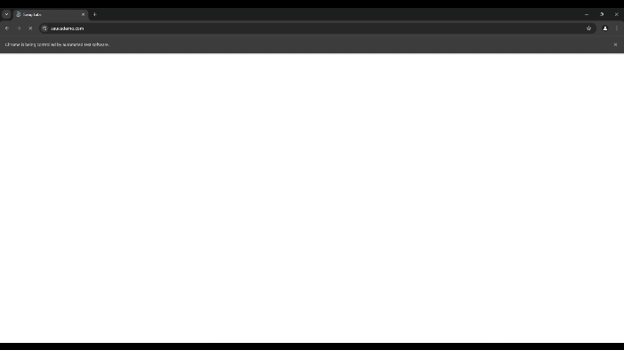

# Selenium Web Testing Project

## Contents 

- [Overview](#overview)
- [Setup Instructions](#setup-instructions)
- [Framework Architecture](#framework-architecture)
- [Features, Scenarios, and Defects](#features-scenarios-and-defects)
- [Test Metrics](#test-metrics)
- [Defects](#defects)

## Overview

This is a web testing project for testing the functionality of the [Sauce Demo](https://www.saucedemo.com/) made-for-testing e-commerce site, created by Owen Graham. 
The project uses Cucumber for BDD and Selenium for web test automation. 
The purpose of the project is to demonstrate my ability to write test cases, automate them in Selenium, integrate them into a CI pipeline, and unit test helper methods using Mockito.
For further information contact the owner of this repository.

## Setup Instructions

In order to download the project and run the tests follow these instructions:

1. Clone this repo to your local machine by running `git clone https://github.com/OwenGraham/selenium-demo.git`
2. Update Chrome to the latest version on your machine.
3. Download the latest stable release of ChromeDriver from [here](https://googlechromelabs.github.io/chrome-for-testing/).
4. Extract the folder into `src/test/resources/webdrivers` and rename it to `webdrivers`

### To run the tests:
1. Open a new terminal and navigate to the root of the repository. 
2. Run the command `mvn test -Dtest="com.github.owengraham.selenium_project.runners.*Test"`.
3. A html Cucumber report with the test results will be generated at `cucumber-report/cucumber.html`.

### Running in suites

Tests are organised into suites using junit tag annotations, such as @functional and @negative. 
To run the tests in suites, add the name of the ga, without the "@", in quotation marks to the `@IncludeTags` annotation in `src/test/java/com/github/owengraham/selenium_project/runners/RunCucumberTest.java`.

#### Example
```java
@Suite
//Add Tests to run here by their tags
@IncludeTags({
        "functional",
        "negative"
})
@SelectClasspathResource("features")
@ConfigurationParameter(key = Constants.GLUE_PROPERTY_NAME,value = "com.github.owengraham.selenium_project.stepdefinitions")
//To run tests with combinations of tags, uncomment this line and add the desired tags to the value string
//@ConfigurationParameter(key = Constants.FILTER_TAGS_PROPERTY_NAME, value = "@functional and @negative")
@ConfigurationParameter(key = Constants.PLUGIN_PROPERTY_NAME, value = "html:cucumber-report/cucumber.html")
public class RunCucumberTest {

}
```

### Running in headed mode

To see the tests running on a screen remove the following line from the method `getChromeOptions()` in `src/test/java/com/github/owengraham/selenium_project/utils/DriverManager.java`:
```java
options.addArguments("headless"); 
```


## Framework Architecture

The framework is written in Java, uses Maven for dependency, and build management predominantly built around Cucumber and Selenium.
Tests are written in Gherkin features and scenarios, which can be found at `src/test/resources/features`, and are linked to the step definitions in `src/test/java/com/github/owengraham/selenium_project/stepdefinitions` via `src/test/java/com/github/owengraham/selenium_project/runners/RunCucumberTest.java`.
Step definitions are split into a class per feature, and those which are used in multiple features are in `CommonStepDefs.java`.

Selenium automates the interactions with the website by controlling a WebDriver object. The setup of the WebDriver, including setting options such as running in headed/headless mode, and setting the window size, is in `src/test/java/com/github/owengraham/selenium_project/utils/DriverManager.java`.
The WebDriver is passed between different step definition classes using a Cucumber PicoContainer, which is initialised and configured in `src/test/java/com/github/owengraham/selenium_project/utils/PicoContainerConfig.java`.

`@Before` and `@After` methods in `src/test/java/com/github/owengraham/selenium_project/stepdefinitions/Hooks.java` manage resetting the state of the WebDriver between tests.  

The framework uses the Page Object Model to improve extensibility and maintainability, with a class for each page of the website, and some page elements (such as products shown on the inventory page), containing locators for page elements and methods for interactions for use in step definitions. These classes can be found in `src/test/java/com/github/owengraham/selenium_project/pages`. 
All methods within the page classes have been unit tested using Junit and Mockito, ensuring they work in edge cases such as when there are no products in the website's inventory. These tests are integrated into a CI pipeline for quality control of the framework itself.
The unit tests can be found in `src/test/java/com/github/owengraham/selenium_project/junit`, and can be run by navigating to the repository root in a terminal and running the command `mvn test -Dtest="com.github.owengraham.selenium_project.junit.*Test"`.

### CI Pipeline

The GitHub repository for the project includes a CI pipeline using GitHub action workflows for building, testing, and branch protection.
The workflow files for the CI pipeline can be found in `.github/workflows`.

The workflow in `unit_tests.yml` runs on pushes and pull requests to the branch `test` and has two jobs:

1. Building the project with Maven
2. Running the unit tests for the methods within the page classes

These jobs are enforced as checks in the branch protection rules of the `test` branch, to stop bugs in the framework from reaching it.

The workflow in `cucumber_tests.yml` runs on pushes and pull requests to the `main` branch. This workflow enforces that all the Cucumber tests must pass for code to be pushed up to this branch.
This is so that if the code for the website itself were in the same project as this test framework, bugs would be caught before reaching the live website.

### Maintenance

The framework's dependencies should be updated to the latest versions in the properties of `POM.xml`:
```xml
<properties>
    <maven.compiler.source>22</maven.compiler.source>
    <maven.compiler.target>22</maven.compiler.target>
    <project.build.sourceEncoding>UTF-8</project.build.sourceEncoding>
    <cucumber.version>7.18.1</cucumber.version>
    <selenium.version>4.25.0</selenium.version>
    <junit.version>5.11.0</junit.version>
    <mockito.version>5.12.0</mockito.version>
    <jmeter.version>5.6.3</jmeter.version>
</properties>
```

## Features, Scenarios, and Defects

| Feature                                                                                       | Scenario                                                                       | Tags                              | Defect                                                                                                                                                              |
|-----------------------------------------------------------------------------------------------|--------------------------------------------------------------------------------|-----------------------------------|---------------------------------------------------------------------------------------------------------------------------------------------------------------------|
| [Cart Page](https://github.com/OwenGraham/selenium-demo/issues/10)                            | Removing a product from the cart as standard_user                              | @cart, @functional, @positive     |                                                                                                                                                                     |
|                                                                                               | Viewing products in the cart as standard_user                                  | @cart, @functional, @positive     |                                                                                                                                                                     |
|                                                                                               | Using Continue Shopping button to return to inventory page as standard_user    | @cart, @functional                |                                                                                                                                                                     |
|                                                                                               | Removing a product from the cart as error_user                                 | @cart, @functional, @negative     |                                                                                                                                                                     |
|                                                                                               | Removing a product from the cart as error_user                                 | @cart, @functional, @negative     |                                                                                                                                                                     |
|                                                                                               | Viewing products in the cart as error_user                                     | @cart, @functional, @negative     | [Add to cart button not working for some products on inventory page as error_user](https://github.com/OwenGraham/selenium-demo/issues/13#issue-2524871010)          |
|                                                                                               | Using Continue Shopping button to return to inventory page as error_user       | @cart, @functional                |                                                                                                                                                                     |
| Checkout Process                                                                              | Initiating checkout process as standard_user                                   | @functional, @positive, @checkout |                                                                                                                                                                     |
|                                                                                               | Filling out checkout information with valid data as standard_user              | @functional, @positive, @checkout |                                                                                                                                                                     |
|                                                                                               | Submitting checkout information with missing first name as standard_user       | @functional, @negative, @checkout |                                                                                                                                                                     |
|                                                                                               | Submitting checkout information with missing last name as standard_user        | @functional, @negative, @checkout |                                                                                                                                                                     |
|                                                                                               | Submitting checkout information with missing postcode as standard_user         | @functional, @negative, @checkout |                                                                                                                                                                     |
|                                                                                               | Viewing the order summary with item, tax, and total price as standard_user     | @functional, @positive, @checkout | [Tax not calculated correctly](https://github.com/OwenGraham/selenium-demo/issues/16)                                                                               |
|                                                                                               | Completing the checkout process and viewing thank you message as standard_user | @functional, @positive, @checkout |                                                                                                                                                                     |
|                                                                                               | Initiating checkout process as error_user                                      | @functional, @positive, @checkout |                                                                                                                                                                     |
|                                                                                               | Filling out checkout information with valid data as error_user                 | @functional, @positive, @checkout |                                                                                                                                                                     |
|                                                                                               | Submitting checkout information with missing first name as error_user          | @functional, @negative, @checkout |                                                                                                                                                                     |
|                                                                                               | Submitting checkout information with missing last name as error_user           | @functional, @negative, @checkout | [Last name field on checkout page one not working for error_user](https://github.com/OwenGraham/selenium-demo/issues/17)                                            |
|                                                                                               | Submitting checkout information with missing postcode as error_user            | @functional, @negative, @checkout |                                                                                                                                                                     |
|                                                                                               | Viewing the order summary with item, tax, and total price as error_user        | @functional, @positive, @checkout | [Tax not calculated correctly](https://github.com/OwenGraham/selenium-demo/issues/16)                                                                               |
|                                                                                               | Completing the checkout process and viewing thank you message as error_user    | @functional, @positive, @checkout | ["Finish" button on checkout step two page not working for error_user](https://github.com/OwenGraham/selenium-demo/issues/18#issue-2533308216)                      |
| [Inventory Page Functionality](https://github.com/OwenGraham/selenium-demo/issues/7)          | Viewing the inventory page with available products as standard_user            | @functional, @positive            |                                                                                                                                                                     |
|                                                                                               | Sorting products by price (low to high) as standard_user                       | @functional, @positive            |                                                                                                                                                                     |
|                                                                                               | Sorting products by price (high to low) as standard_user                       | @functional, @positive            |                                                                                                                                                                     |
|                                                                                               | Adding a product to the cart and checking cart number as standard_user         | @functional, @positive, @cart     |                                                                                                                                                                     |
|                                                                                               | Adding a product to the cart and checking cart as standard_user                | @functional, @positive, @cart     |                                                                                                                                                                     |
|                                                                                               | Removing a product from the cart as standard_user                              | @functional, @positive, @cart     |                                                                                                                                                                     |
|                                                                                               | Adding multiple products to the cart and checking cart as standard_user        | @functional, @positive, @cart     |                                                                                                                                                                     |
|                                                                                               | Adding multiple products to the cart and checking cart number as standard_user | @functional, @positive@cart       |                                                                                                                                                                     |
|                                                                                               | Sorting products by name (A to Z) as standard_user                             | @functional, @positive            |                                                                                                                                                                     |
|                                                                                               | Sorting products by name (Z to A) as standard_user                             | @functional, @positive            |                                                                                                                                                                     |
|                                                                                               | Viewing product details from the inventory page as standard_user               | @functional, @positive            |                                                                                                                                                                     |
|                                                                                               | Viewing the inventory page with available products as error_user               | @functional, @positive            |                                                                                                                                                                     |
|                                                                                               | Sorting products by price (low to high) as error_user                          | @functional, @positive            | [Product sorting functionality not working as error_user](https://github.com/OwenGraham/selenium-demo/issues/14#issue-2524900975)                                   |
|                                                                                               | Sorting products by price (high to low) as error_user                          | @functional, @positive            | [Product sorting functionality not working as error_user](https://github.com/OwenGraham/selenium-demo/issues/14#issue-2524900975)                                   |
|                                                                                               | Adding a product to the cart and checking cart number as error_user            | @functional, @positive, @cart     |                                                                                                                                                                     |
|                                                                                               | Adding a product to the cart and checking cart as error_user                   | @functional, @positive, @cart     |                                                                                                                                                                     |
|                                                                                               | Removing a product from the cart as error_user                                 | @functional, @positive, @cart     | [Remove button on some products on inventory page not working when logged in as error_user](https://github.com/OwenGraham/selenium-demo/issues/12#issue-2524828069) |
|                                                                                               | Adding multiple products to the cart and checking cart as error_user           | @functional, @positive, @cart     | [Add to cart button not working for some products on inventory page as error_user](https://github.com/OwenGraham/selenium-demo/issues/13#issue-2524871010)          |
|                                                                                               | Adding multiple products to the cart and checking cart number as error_user    | @functional, @positive, @cart     | [Add to cart button not working for some products on inventory page as error_user](https://github.com/OwenGraham/selenium-demo/issues/13#issue-2524871010)          |
|                                                                                               | Sorting products by name (A to Z) as error_user                                | @functional, @positive            |                                                                                                                                                                     |
|                                                                                               | Sorting products by name (Z to A) as error_user                                | @functional, @positive            | [Product sorting functionality not working as error_user](https://github.com/OwenGraham/selenium-demo/issues/14#issue-2524900975)                                   |
|                                                                                               | Viewing product details from the inventory page as error_user                  | @functional, @positive            |                                                                                                                                                                     |
| [Login Functionality](https://github.com/OwenGraham/selenium-demo/issues/1#issue-2492022579)  | Successful login with valid credentials                                        | @functional, @happy_path          |                                                                                                                                                                     |
|                                                                                               | Unsuccessful login with incorrect credentials                                  | @functional, @invalid_login       |                                                                                                                                                                     |
|                                                                                               | Unsuccessful login with empty username                                         | @functional, @invalid_login       |                                                                                                                                                                     |
|                                                                                               | Unsuccessful login with empty password                                         | @functional, @invalid_login       |                                                                                                                                                                     |
|                                                                                               | Unsuccessful login with locked-out user                                        | @functional, @locked_out_user     |                                                                                                                                                                     |

## Test Metrics


## Defects

<div style="text-align: center;">


</div>

<div style="display: table; margin: auto;">

| Defect          | Remove button on some products on inventory page not working when logged in as error_user                                                                                                         |
|-----------------|---------------------------------------------------------------------------------------------------------------------------------------------------------------------------------------------------|
| Date            | 13/09/2024                                                                                                                                                                                        |
| Details         | When logged in as error_user, the remove from cart button for some items on the inventory page has no effect                                                                                      |
| Expected Result | Clicking remove from cart on an item should make the button change to say "add to cart", the number next the the cart should decrement by one, and the item should not be listed on the cart page |
| Actual Result   | Clicking the remove from cart button has no effect                                                                                                                                                |
| Test Data       | Item: Sauce Labs Backpack                                                                                                                                                                         |
| Environment     | OS: Widows 11 Home x64, Browser: Chrome Version 128.0.6613.137                                                                                                                                    |
| Future Steps    |                                                                                                                                                                                                   | 

</div>

<div style="text-align: center;">


</div>

<div style="display: table; margin: auto;">

| Defect          | Product sorting functionality not working as error_user                                                                                         |
|-----------------|-------------------------------------------------------------------------------------------------------------------------------------------------|
| Date            | 13/09/2024                                                                                                                                      |
| Details         | When logged in as error_user, the sorting functionality on the inventory page does't work                                                       |
| Expected Result | Selecting an option from sort by dropdown menu on the inventory page should sort the products accordingly                                       |
| Actual Result   | When an option is selected from the dropdown, an alert appears with the message "Sorting is broken! This error has been reported to Backtrace." |
| Test Data       |                                                                                                                                                 |
| Environment     | OS: Windows 11 Home x64, Browser: Chrome Version 128.0.6613.137                                                                                 |
| Future Steps    |                                                                                                                                                 |

</div>

<div style="text-align: center;">


</div>

<div style="display: table; margin: auto;">

| Defect          | Add to cart button not working for some products on inventory page as error_user                                                                                                                                 |
|-----------------|------------------------------------------------------------------------------------------------------------------------------------------------------------------------------------------------------------------|
| Date            | 13/09/2024                                                                                                                                                                                                       |
| Details         | When logged in as error_user, the add to cart button on some products on the inventory page does not work                                                                                                        |
| Expected Result | clicking add to cart button on any inventory page item should change the button to remove from cart, the number next to the cart icon should increment by one, and the product should be listed on the cart page |
| Actual Result   | clicking add to cart button has no effect                                                                                                                                                                        |
| Test Data       | product: Sauce Labs Bolt T-Shirt                                                                                                                                                                                 |
| Environment     | OS: Windows 11 Home x64, Browser: Chrome Version 128.0.6613.137                                                                                                                                                  |
| Future Steps    |                                                                                                                                                                                                                  |

</div>

<div style="text-align: center;">



</div>

<div style="display: table; margin: auto;">

| Defect          | Last name field on checkout page one not working for error_user                                                                                                                                                                                                                                                           |
|-----------------|---------------------------------------------------------------------------------------------------------------------------------------------------------------------------------------------------------------------------------------------------------------------------------------------------------------------------|
| Date            | 18/09/2024                                                                                                                                                                                                                                                                                                                |
| Details         | When logged in as error_user, the last name field on checkout page one does not accept any input (clicking the field and entering keys does not alter the text displayed in the field). The form then accepts the data and allows the user to continue with the checkout process despite the last name field being blank. |
| Expected Result | Selecting the Last Name field on the checkout page one and entering keys should cause the entered keys to display in the input field. Clicking the continue button without a last name being in the input field should not navigate to the checkout step two page and an error message should be displayed instead.       |
| Actual Result   | Entering keys with the last name field selected does not change text displayed in field from "Last Name"                                                                                                                                                                                                                  |
| Test Data       |                                                                                                                                                                                                                                                                                                                           |
| Environment     | OS: Windows Home x64, Browser: Chrome version 128.0.6613.138                                                                                                                                                                                                                                                              |
| Future Steps    |                                                                                                                                                                                                                                                                                                                           |

</div>

<div style="text-align: center;">


</div>

<div style="display: table; margin: auto;">

| Defect          | Tax not calculated correctly                                                                                                                                                                                              |
|-----------------|---------------------------------------------------------------------------------------------------------------------------------------------------------------------------------------------------------------------------|
| Date            | 18/09/2024                                                                                                                                                                                                                |
| Details         | When logged in as standard_user, the amount of tax displayed on the checkout step two is not consistent with the current UK VAT rate (20%), and in fact the tax rate seems to vary depending on the products in the cart. |
| Expected Result | Tax should be $6.00                                                                                                                                                                                                       |
| Actual Result   | Tax is $2.40                                                                                                                                                                                                              |
| Test Data       | Product in cart is x1 Sauce Labs Backpack                                                                                                                                                                                 |
| Environment     | OS: Windows Home x64, Browser: Chrome version 128.0.6613.138                                                                                                                                                              |
| Future Steps    |                                                                                                                                                                                                                           |

</div>

<div style="text-align: center;">


</div>

<div style="display: table; margin: auto;">

| Defect          | "Finish" button on checkout step two page not working for error_user                                                   |
|-----------------|------------------------------------------------------------------------------------------------------------------------|
| Date            | 18/09/2024                                                                                                             |
| Details         | When logged in as error_user, "Finish" button does not navigate to checkout complete page.                             |
| Expected Result | Clicking "Finish" button on checkout step two page should navigate to https://www.saucedemo.com/checkout-complete.html |
| Actual Result   | Clicking "Finish" button on checkout step two page has no effect                                                       |
| Test Data       |                                                                                                                        |
| Environment     | OS: Windows Home x64, Browser: Chrome version 128.0.6613.138                                                           |
| Future Steps    |                                                                                                                        |
</div>
